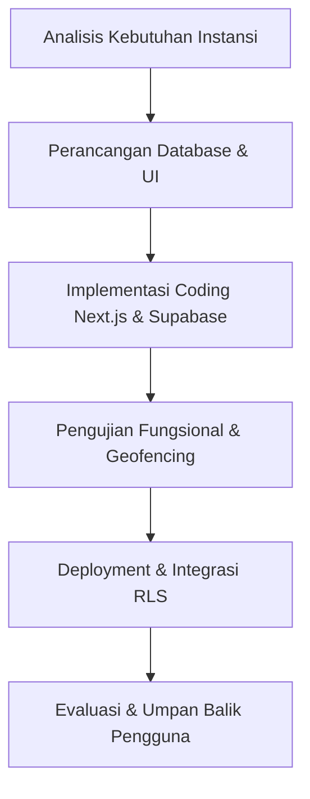
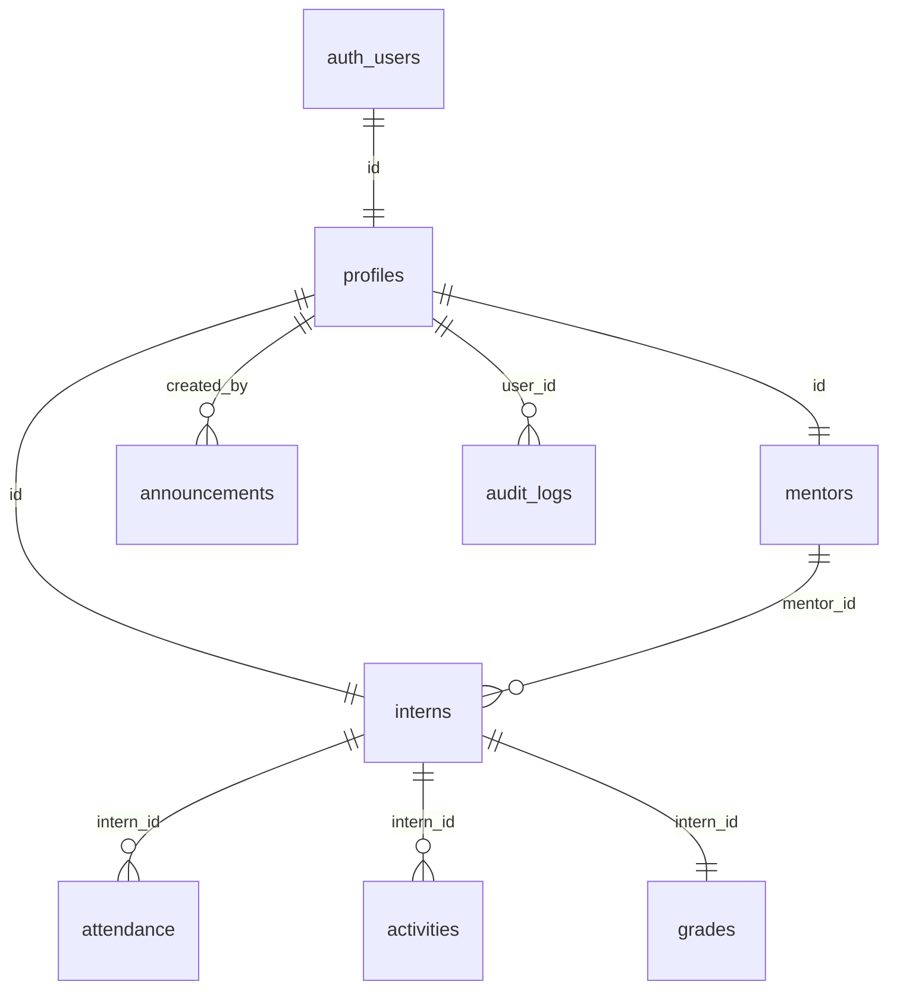

# SISTEM INFORMASI MANAJEMEN MAGANG (SIMANG) BERBASIS WEB DENGAN VERIFIKASI GEOFENCING PADA BADAN PERENCANAAN PEMBANGUNAN DAERAH (BAPPEDA) ACEH

Dokumen ini disusun sebagai bagian dari Laporan Kuliah Kerja Praktek (KKP) / Kerja Praktek mahasiswa Informatika/Sistem Informasi dalam merancang dan membangun aplikasi **SIMANG (Sistem Informasi Manajemen Magang) Bappeda Aceh**.

---

## KATA PENGANTAR

Puji dan syukur penulis panjatkan ke hadirat Allah SWT, karena atas rahmat dan karunia-Nya, penulis dapat menyelesaikan perancangan serta pembangunan sistem informasi manajemen magang bernama **SIMANG Bappeda Aceh**. Aplikasi ini dirancang untuk mendigitalisasi, mengotomatisasi, dan meningkatkan efisiensi tata kelola administrasi peserta magang pada Kantor Badan Perencanaan Pembangunan Daerah (Bappeda) Aceh.

Penulis menyadari bahwa keberhasilan proyek ini tidak lepas dari bimbingan, arahan, dan kerja sama dari berbagai pihak. Oleh karena itu, penulis ingin mengucapkan terima kasih yang sebesar-besarnya kepada:
1. **Kepala Badan Perencanaan Pembangunan Daerah (Bappeda) Aceh** beserta seluruh jajaran staf yang telah memberikan izin dan memfasilitasi pelaksanaan Kuliah Kerja Praktek (KKP) ini.
2. **Pembimbing Lapangan/Instansi** yang telah meluangkan waktu untuk memberikan pengarahan terkait kebutuhan bisnis dan pengawasan operasional magang.
3. **Dosen Pembimbing KKP** yang senantiasa membimbing, mengoreksi, dan memberi masukan berharga demi kesempurnaan sistem ini.
4. Seluruh rekan-rekan peserta magang yang ikut membantu memberikan umpan balik pengguna selama proses pengujian sistem.

Semoga aplikasi SIMANG Bappeda Aceh ini dapat memberikan manfaat nyata bagi efisiensi operasional Bappeda Aceh dan menjadi referensi akademik yang berguna untuk pengembangan riset selanjutnya.

Banda Aceh, 4 Juli 2026

Penulis

---

## BAB I: PENDAHULUAN

### 1.1 Latar Belakang
Setiap tahunnya, Badan Perencanaan Pembangunan Daerah (Bappeda) Aceh menerima puluhan mahasiswa dan siswa dari berbagai universitas dan sekolah menengah kejuruan untuk melaksanakan program magang/Kerja Praktek. Namun, proses manajemen administratif peserta magang sebelumnya masih dilakukan secara manual dan konvensional:
1. **Pendaftaran & Pencatatan Data**: Pendaftar harus mengisi formulir fisik atau admin menginput satu per satu data anak magang ke spreadsheet.
2. **Presensi/Kehadiran**: Masih menggunakan lembar kertas absen bertandatangan basah yang rentan terhadap manipulasi (titip absen), kerusakan, atau kehilangan.
3. **Pelaporan Jurnal Harian**: Peserta magang mencatat kegiatan harian di buku log fisik yang baru diperiksa oleh mentor di akhir periode, sehingga pemantauan aktivitas harian berjalan lambat.
4. **Penilaian Akhir**: Mentor harus merekap nilai secara manual di akhir program menggunakan kalkulasi kalkulator fisik yang rawan kesalahan hitung.

Di era transformasi digital ini, sangat diperlukan sebuah sistem terpadu untuk menyelesaikan masalah tersebut. Oleh karena itu, dibangun aplikasi **SIMANG** berbasis web dengan fitur utama **Geofencing Verification** untuk memastikan validasi kehadiran peserta magang secara presisi berdasarkan posisi koordinat geografis (GPS) mereka secara real-time saat berada di area kantor Bappeda Aceh.

### 1.2 Rumusan Masalah
Berdasarkan latar belakang di atas, rumusan masalah dalam pembangunan sistem ini adalah:
1. Bagaimana mempermudah proses pendaftaran mandiri anak magang secara publik tanpa menambah beban input manual dari administrator?
2. Bagaimana memvalidasi presensi peserta magang agar kehadiran hanya dapat dicatat saat posisi fisik mereka benar-benar berada di dalam radius resmi kantor Bappeda Aceh?
3. Bagaimana mendigitalisasi pelaporan jurnal kegiatan harian dan sistem penilaian kinerja agar dapat ditinjau secara langsung oleh mentor pembimbing masing-masing?

### 1.3 Tujuan KKP
Tujuan dari pelaksanaan KKP dan pembangunan sistem ini adalah:
1. Membangun aplikasi **SIMANG Bappeda Aceh** berbasis web dengan framework Next.js dan backend database Supabase.
2. Mengintegrasikan fitur **Geofencing** menggunakan rumus jarak koordinat bumi (Haversine Formula) untuk mengunci presensi anak magang di area Bappeda Aceh.
3. Menyediakan dasbor khusus untuk tiga tingkat hak akses: **Admin** (pengelola umum), **Mentor** (staf pembimbing lapangan), dan **Intern** (anak magang).

### 1.4 Manfaat KKP
* **Bagi Mahasiswa**:
  * Mengaplikasikan teori pemrograman web modern, desain database relasional, dan manajemen keamanan berbasis Row Level Security (RLS).
  * Memahami metode analisis kebutuhan sistem secara nyata di instansi pemerintahan.
* **Bagi Bappeda Aceh**:
  * Menghilangkan proses pencatatan berbasis kertas (*paperless*) untuk mengurangi biaya operasional.
  * Mencegah kecurangan presensi melalui validasi lokasi GPS yang akurat.
  * Mempermudah pencarian rekapitulasi data magang, absensi, jurnal harian, dan penilaian akhir secara instan.

### 1.5 Deskripsi Topik dan Metode Terkait
Topik utama KKP ini adalah pengembangan perangkat lunak sistem informasi manajemen berbasis geofencing. 
* **Geofencing**: Teknologi pembatasan wilayah geografis virtual. Sistem memanfaatkan API Geolocation pada browser perangkat pengguna untuk mengambil titik koordinat lintang (*latitude*) dan bujur (*longitude*).
* **Haversine Formula**: Persamaan matematika untuk menghitung jarak lingkaran besar antara dua titik koordinat di permukaan bumi. Rumus ini diimplementasikan di frontend untuk menentukan apakah jarak peserta magang ke titik pusat kantor Bappeda Aceh (Latitude: `5.560601`, Longitude: `95.321852`) berada di bawah batas radius toleransi (50 meter).

---

## BAB III: METODE DAN PROSES KERJA

### 3.4 Metode dan Proses Kerja
Pengembangan aplikasi SIMANG menerapkan metode **Agile Software Development** yang adaptif dan cepat dengan tahapan proses kerja sebagai berikut:



1. **Tahap Analisis Kebutuhan**:
   Mengidentifikasi kendala administrasi magang di Bappeda Aceh serta menyusun spesifikasi kebutuhan fungsional bagi Admin, Mentor, dan Anak Magang.
2. **Tahap Perancangan**:
   Merancang struktur relasi tabel database PostgreSQL di Supabase serta membuat desain antarmuka dasbor yang bersih dan padat informasi (*data-dense*).
3. **Tahap Coding (Implementasi)**:
   * Menggunakan framework **Next.js 16** (App Router) untuk frontend yang cepat.
   * Menggunakan **TailwindCSS** untuk styling antarmuka responsif.
   * Menggunakan **Supabase SDK** untuk otentikasi pengguna, penyimpanan data real-time, dan manajemen hak akses data melalui *Row Level Security* (RLS).
4. **Tahap Pengujian (Testing)**:
   Menguji keandalan sistem menggunakan dua pendekatan utama:
   * **Black Box Testing**: Memastikan fungsionalitas seluruh elemen antarmuka, tombol, penanganan kesalahan email duplikat, dan hak akses dashboard berjalan lancar tanpa kendala teknis.
   * **Geofencing Simulation Testing**: Memvalidasi akurasi perhitungan jarak Haversine Formula pada GPS secara real-time dengan menyimulasikan koordinat pengguna di dalam dan di luar batas radius toleransi 50 meter dari Kantor Bappeda Aceh.

---

## BAB IV: HASIL DAN PEMBAHASAN

### 4.1 Analisis Kebutuhan
Sistem mengakomodasi tiga aktor utama dengan kebutuhan fungsional sebagai berikut:
* **Anak Magang (Intern)**: Melakukan registrasi mandiri, mengajukan presensi harian (check-in/check-out) tervalidasi GPS, mengisi jurnal tugas harian, memantau nilai akhir, dan mengunggah laporan akhir magang (.pdf).
* **Mentor**: Meninjau dan menyetujui/menolak jurnal harian anak bimbingannya, memverifikasi laporan akhir, serta memberikan penilaian kinerja akhir.
* **Admin**: Menyetujui pendaftaran anak magang baru (status *pending* ke *active*), menetapkan mentor pendamping, mengelola pengumuman instansi, serta memantau ringkasan log audit aktivitas.

### 4.2 Perancangan Sistem

#### 4.2.1 Pembuatan Sistem SISTEM INFORMASI MANAJEMEN MAGANG (SIMANG)
Sub-bab ini menguraikan tahapan dan metodologi dalam pembuatan serta implementasi Sistem Informasi Manajemen Magang (SIMANG) Bappeda Aceh. Proses pembuatan sistem ini mengintegrasikan framework Next.js 16 sebagai antarmuka pengguna (frontend) yang dinamis, dengan Supabase sebagai penyedia infrastruktur backend-as-a-service (BaaS) berbasis cloud yang mengelola database relasional PostgreSQL, sistem autentikasi, serta Row Level Security (RLS) secara real-time. Bahasa pemrograman utama yang digunakan adalah TypeScript untuk memastikan tipe data yang aman dan meminimalkan kesalahan saat pengembangan kode program. Pada tahap implementasi, sistem dikonfigurasi menggunakan TailwindCSS guna menghasilkan tata letak antarmuka yang responsif, minimalis, dan padat informasi (*data-dense*) agar optimal saat diakses melalui perangkat desktop maupun mobile. Melalui integrasi teknologi ini, SIMANG dikembangkan untuk mendigitalisasi tiga pilar utama administrasi magang di Bappeda Aceh: proses pendaftaran mandiri calon magang yang terotomatisasi, sistem presensi berbasis lokasi nyata menggunakan geofencing koordinat GPS, serta pencatatan jurnal harian dan penilaian akhir magang secara transparan. Keseluruhan modul dalam pembuatan sistem ini disinkronkan secara terpusat untuk mewujudkan sistem informasi tata kelola magang instansi pemerintah yang handal, efisien, aman, dan bebas dari penggunaan kertas (*paperless*).

#### 4.2.2 Desain Database dan Arsitektur
Arsitektur database dirancang menggunakan **Supabase PostgreSQL** yang terdiri dari tabel-tabel utama berikut:



* **`profiles`**: Menyimpan data dasar pengguna (ID, Nama Lengkap, Peran, Avatar).
* **`mentors`**: Menyimpan data tambahan staf mentor pembimbing (NIP, Bidang/Departemen).
* **`interns`**: Menyimpan data akademik anak magang (NIM/NISN, Instansi, Jurusan, Periode Magang, Mentor, Status, File Laporan).
* **`attendance`**: Menyimpan log presensi harian (Waktu Masuk, Waktu Pulang, Status Hadir/Sakit/Izin, Catatan, Koordinat GPS, Status Radius Geofencing).
* **`activities`**: Jurnal harian peserta (Deskripsi Tugas, Status Approval, Feedback Mentor).
* **`grades`**: Penilaian kinerja (Disiplin, Tanggung Jawab, Keahlian Teknis, Sikap, Rata-rata Nilai Akhir).
* **`audit_logs`**: Rekaman log audit keamanan akses masuk/keluar sistem.

Keamanan data diperketat menggunakan **Row Level Security (RLS) Policies** di Supabase untuk membatasi akses:
* Pengguna umum hanya bisa membaca profil.
* Anak magang hanya diperbolehkan melakukan *insert* presensi dan jurnal yang memiliki `intern_id = auth.uid()`.
* Kebijakan RLS khusus ditambahkan untuk pendaftaran mandiri agar calon anak magang dapat memasukkan datanya sendiri ke tabel `interns` sebelum disetujui admin.

### 4.3 Hasil Pengembangan Sistem
Berikut adalah implementasi halaman utama aplikasi SIMANG:
1. **Landing Page & Registrasi Mandiri**: Pendaftar mengisi data instansi, tanggal mulai dan selesai magang, serta sandi akun. Setelah sukses mengirim data, pendaftar akan melihat indikator proses antrean verifikasi Admin yang rapi dan terstruktur (*timeline stepper*).
2. **Dashboard Utama**: Menampilkan indikator kartu ringkasan jumlah anak magang, mentor aktif, persentase kehadiran masing-masing anak magang, serta log status kehadiran hari ini.
3. **Modul Presensi Geofencing**: Halaman check-in anak magang dilengkapi peta koordinat GPS. Tombol check-in hanya akan aktif jika jarak ke kantor Bappeda Aceh ≤ 50 meter. Terdapat fitur toleransi bypass khusus dengan catatan tertulis untuk keadaan khusus.

### 4.4 Pengujian Sistem
Pengujian sistem dilakukan secara menyeluruh menggunakan dua metode pengujian utama:

#### 1. Black Box Testing (Pengujian Fungsional)
Pengujian ini memverifikasi input dan fungsionalitas tombol/formulir tanpa melihat kode program. Hasil pengujian dirangkum dalam tabel berikut:

| No | Fitur / Kasus Uji | Langkah Pengujian | Hasil Yang Diharapkan | Hasil Pengujian | Status |
|---|---|---|---|---|---|
| 1 | Pendaftaran Akun | Mengisi formulir register dengan data valid. | Akun dibuat dengan status `'pending'` & diarahkan ke *timeline stepper*. | Sesuai Harapan | **Pass** |
| 2 | Deteksi Email Duplikat | Mendaftar kembali dengan email yang sama. | Pendaftaran ditolak dengan peringatan *"Email ini sudah terdaftar..."*. | Sesuai Harapan | **Pass** |
| 3 | Login & Autentikasi | Memasukkan email & password yang telah disetujui. | Masuk ke dashboard internal sesuai role (Admin/Mentor/Intern). | Sesuai Harapan | **Pass** |
| 4 | Pengisian Jurnal Harian | Menginput jurnal tugas harian baru. | Jurnal tercatat dengan status `'pending'` & tampil di dasbor Mentor. | Sesuai Harapan | **Pass** |
| 5 | Persetujuan Jurnal | Mentor menyetujui jurnal & memberi umpan balik. | Status jurnal berubah menjadi `'approved'` dan feedback terlihat oleh anak magang. | Sesuai Harapan | **Pass** |
| 6 | Penilaian Akhir | Mentor menginput 4 kriteria nilai magang. | Rata-rata nilai terhitung otomatis oleh sistem dan tersimpan di tabel `grades`. | Sesuai Harapan | **Pass** |

#### 2. Geofencing Simulation Testing (Pengujian Lokasi GPS)
Pengujian ini khusus menguji keandalan deteksi wilayah virtual (pagar geografis) Bappeda Aceh menggunakan perhitungan Haversine Formula:

* **Skenario A (Pengguna Berada di Luar Radius 50m)**:
  * *Tindakan*: Mengambil lokasi GPS di koordinat perumahan (jarak ~1.2 km dari kantor).
  * *Hasil*: Sistem mendeteksi jarak 1200 meter. Status menampilkan *"Di Luar Radius Bappeda"*. Tombol check-in terkunci (disabled) secara otomatis.
* **Skenario B (Pengguna Berada di Dalam Radius 50m)**:
  * *Tindakan*: Mengaktifkan lokasi presisi di dalam gedung Bappeda Aceh (atau simulasi koordinat Bappeda).
  * *Hasil*: Jarak terhitung 0 - 15 meter. Status menampilkan *"Di Dalam Radius Bappeda"*. Tombol check-in berubah menjadi hijau aktif (enabled) dan absensi berhasil dilakukan.

### 4.5 Pembahasan Hasil
Dengan diimplementasikannya SIMANG Bappeda Aceh:
* **Akurasi Presensi Meningkat**: Kehadiran fiktif dapat ditekan sepenuhnya berkat validasi otomatis koordinat GPS.
* **Proses Evaluasi Cepat**: Jurnal harian dilaporkan secara real-time dan dapat dinilai oleh mentor kapan saja tanpa perlu menunggu akhir bulan.
* **Transparansi Kinerja**: Anak magang dapat melihat langsung rekap absensi, latensi keterlambatan (toleransi s/d 08:15 WIB), serta catatan evaluasi dari mentor mereka secara langsung di dasbor mereka.

---

## BAB V: PENUTUP

### 5.1 Kesimpulan
Berdasarkan hasil rancang bangun aplikasi SIMANG Bappeda Aceh, dapat ditarik kesimpulan:
1. Framework **Next.js** dan backend **Supabase** terbukti sangat andal dan efisien dalam menyajikan aplikasi web satu halaman (SPA) berkinerja tinggi dengan integritas data yang aman melalui RLS policies.
2. Fitur **Geofencing** yang memanfaatkan rumus Haversine berhasil memvalidasi kehadiran fisik anak magang di area Bappeda Aceh secara presisi dan real-time.
3. Proses pendaftaran mandiri berhasil menghemat waktu administrator secara signifikan melalui alur persetujuan digital yang terpusat.

### 5.2 Saran
Untuk pengembangan sistem lebih lanjut, disarankan beberapa peningkatan berikut:
1. **Integrasi Notifikasi WhatsApp/Email**: Mengirimkan notifikasi instan kepada peserta magang jika pendaftaran mereka disetujui, atau jika jurnal mereka ditolak oleh mentor.
2. **Mode Luring (Offline Mode)**: Memungkinkan perekaman kehadiran lokal ketika koneksi internet di lokasi kantor mengalami gangguan dan menyinkronkannya saat online kembali.
3. **Aplikasi Native Mobile**: Membangun aplikasi versi Android/iOS untuk meningkatkan akurasi pengambilan GPS di tingkat sistem operasi ponsel pintar.

---

## CARA MENJALANKAN PROJECT

### Prasyarat
* Node.js versi 18 atau yang lebih baru.
* Akun Supabase (untuk database Postgres dan Autentikasi).

### Langkah-langkah Instalasi

1. **Clone Repository dan Masuk ke Folder**:
   ```bash
   cd kkp
   ```

2. **Instalasi Dependensi**:
   ```bash
   npm install
   ```

3. **Konfigurasi Environment Variables**:
   Buat file `.env.local` di root folder dan isi dengan kredensial Supabase Anda:
   ```env
   NEXT_PUBLIC_SUPABASE_URL=https://<project-id>.supabase.co
   NEXT_PUBLIC_SUPABASE_ANON_KEY=<your-anon-key>
   ```

4. **Jalankan Development Server**:
   ```bash
   npm run dev
   ```
   Aplikasi dapat diakses di URL default [http://localhost:3000](http://localhost:3000).

5. **Build untuk Produksi**:
   ```bash
   npm run build
   ```
